# Model

Het staat model voor digitale tuintjes welke bij 'Het web is voor iedereen' door studenten worden gemaakt.

## Learning Log

### 31 aug - Kickoff

Leg uit wat een source hosting platform is en voor welke jij gekozen hebt.
Ik heb gekozen voor Github (en het gebruik van mijn code in het trainen van AI uitgezet)
Vertel welke domeinnaam jij gekozen hebt en hoe je die hebt gekoppeld aan jouw pagina.
Ik heb gekozen voor de naam 'manosodas', die heb ik gekocht en gemaakt via TransIP en dit verder via github (pages) gekoppeld
Beschrijf hoe je aanpassingen aan jouw pagina kunt maken en hoe je er voor zorgt dat die op het web gepubliceerd worden.
Push en pull van mijn codes. Aanpassen in codium, en dit pushen naar de git.

31-08-2026

Een fork van de model repository gemaakt en gepubliceerd via mijn eigen Github omgeving.
Leg uit wat een source hosting platform is en voor welke jij gekozen hebt.
Ik heb gekozen voor Github (en het gebruik van mijn code in het trainen van AI uitgezet)
Vertel welke domeinnaam jij gekozen hebt en hoe je die hebt gekoppeld aan jouw pagina.
Ik heb gekozen voor de naam 'manosodas', die heb ik gekocht en gemaakt via TransIP en dit verder via github (pages) gekoppeld
Beschrijf hoe je aanpassingen aan jouw pagina kunt maken en hoe je er voor zorgt dat die op het web gepubliceerd worden.
Push en pull van mijn codes. Aanpassen in codium, en dit pushen naar de git.

31-08-2026

### 2 sept - Deepdives

Deep dive Typografie
Belangrijke punten vanuit eigen notities:
Wanneer je fonts mixt, is dit logisch; denk aan: stijl, leesbaarhied, opties en beschikbaarheid.
Lijken de letters niet te veel op elkaar, kijk naar de licentie.
Dafont, Google fonts, Adobe fonts en typography.com ff: E in Heineken lijkt op een smiley

Opdracht:
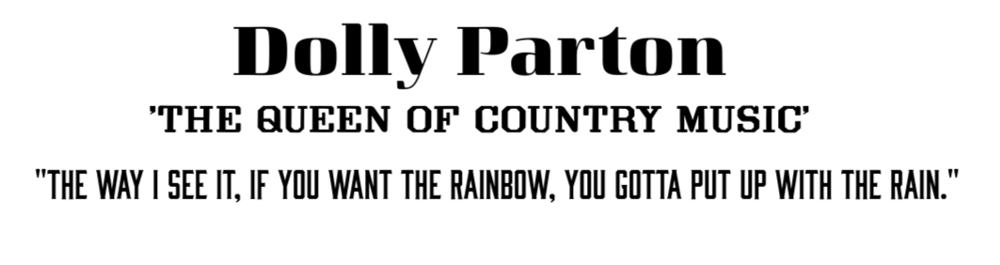

Deep dive MMD interacties

Belangrijke punten vanuit eigen notities:
Wat: Het gebruik van verschillende vormen van interactie
Waarom: Een meer intuïtieve interactie tussen mens en machine

4 componenten

1.  Trigger: Wat zorgt ervoor dat de micro-interactie begint? Is het de actie van een gebruiker (klikken, hoveren, swipen?) of een conditie systeem binnen het (een nieuw bericht, het voltooien van een proces?)
2.  Rules: Wat gebeurt er (systematisch) na de trigger?
3.  Feedback: Welke feedback krijgt de gebruiker? Dit kan visueel zijn, maar ook een trilling of geluid.
4.  Loops: Blijft de micro-interactie een signal geven tot de gebruiker de volgende stap zet?

Opdracht:
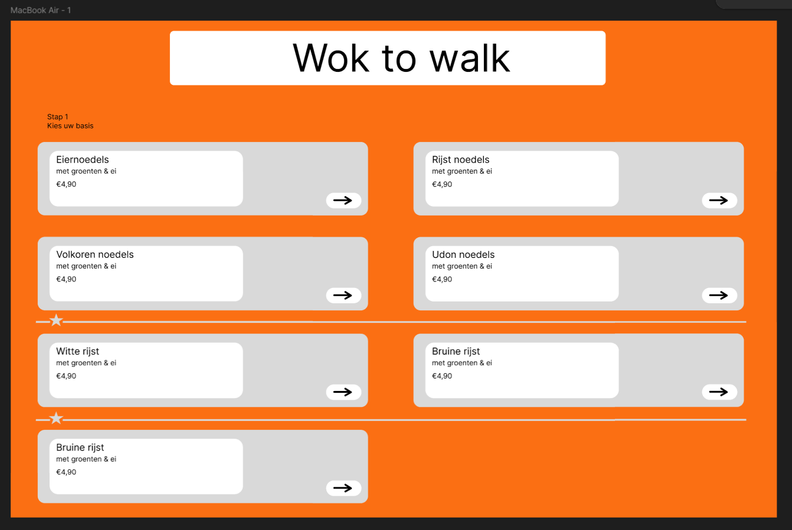
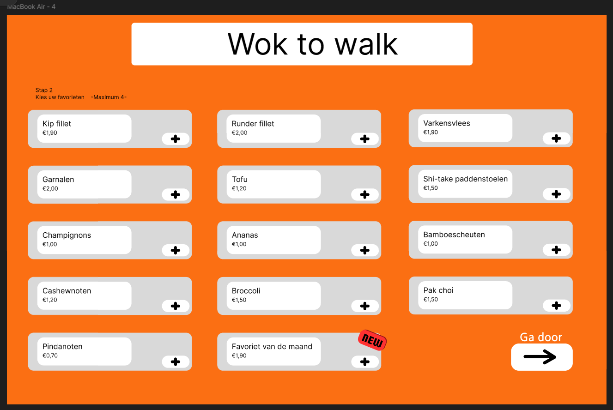
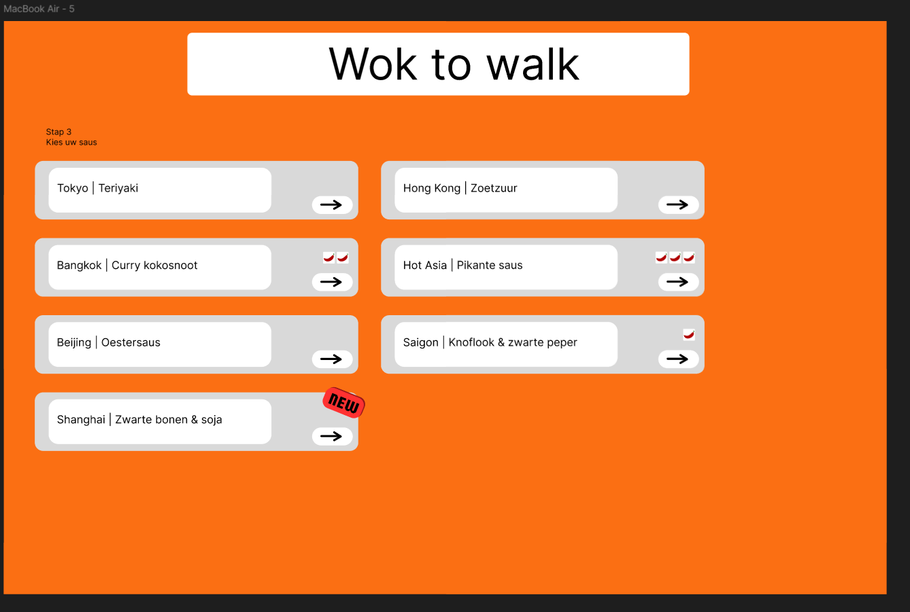

Feedback bij WTW2 verwerkt, nog een knop toegevoegd om door te kunnen klikken.
Vraag: verschil tussen splash screen en home pagina -> Bij splash screen denk aan de loading pagina's bij mobiele apps.

### 4 sept - Deepdives

HTML & CSS basics
Belangrijke punten vanuit eigen notities/artikel

HTML; HyperText Markup Language, CSS; Cascading Style Sheets and JavaScript

HTML is for adding meaning to raw content by marking it up
CSS id for formatting that marked up content
JavaScript is for making that content and formatting interactive

Neem de stylesheet apart om zo te vermijden dat je niet handmatig alles weer moet aanpassen (interne css niet doen, extern aka apart css inladen is ideaal om zo alles aan te kunnen passen met 1 line of code) critical css extern, rest intern
Met cascading, wanneer een regel specifieker is zal dit het andere overschrijven vb: (specificity)
P = blue
Main.article p = blue
Main.article p zal dan gebruikt worden omdat dit specifieker is.
Html = inline en heeft meer specificity dan externe css -> aka meer belangrijk.
notes over javascript
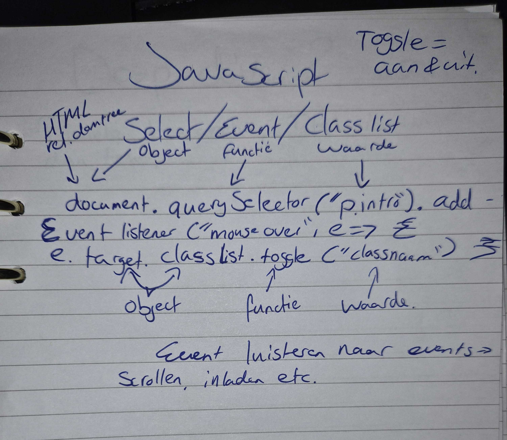

Praktische CSS
opdracht:
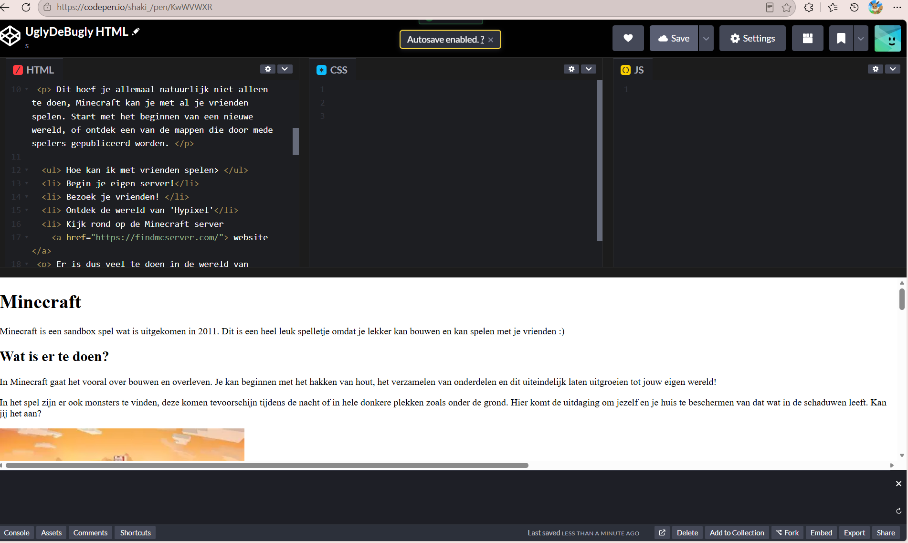
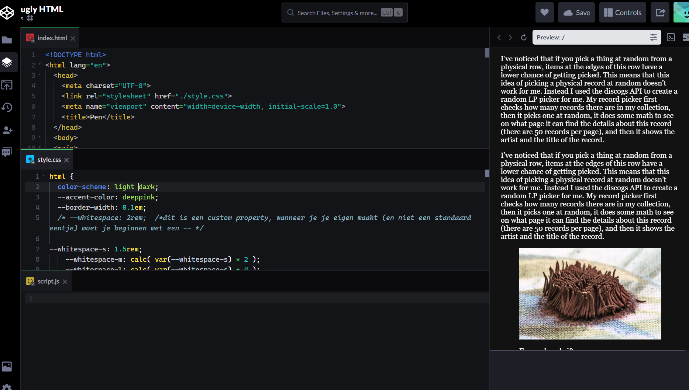

### 7 sept - Kickoff

~Eigen verkenning

1. Vanuit de inventarisatie: Wat zou je zelf willen maken? Heb je dingen gezien die je nog niet kan, maar wel interessant vindt in de websites die je bekeken hebt?
   -Ik wil vooral werken aan animaties, vorig jaar heb ik een hele hele basic website kunnen maken met de simpele hovers. Het was een website maar meer niet. Nu voor mijn digital garden wil ik daar verder op kunnen bouwen. Ook zijn animaties dingen die ik gewoon super tof vind en het dus ideaal is voor mijn DG. Ik zie een website als 2d, en een DG als 3d, op dit idee wil ik verder spelen en zo het een soort pop-up boek maken, maar dan digitaal.

2. Welke webby dingen heb je gezien die je ook wil gebruiken?
   Bewegende achtergronden zoals bij TamaNOTchi, geanimeerde knoppen zoals bij Melonland en het gevoel van VirtualVampirehaven. (met gevoel beddoel ik hoe duidelijk persoonlijk het is.)

3. Welke eigen content zou je over het onderwerp kunnen schrijven? Wat is de toon, ​de context, het doel, wat zijn onderwerpen, wat is ‘het’ wat jou raakt!​
   Ik zou het graag over Griekse mythologie willen maken, het is een onderwerp waar ik sinds kind al veel intersse in heb. Ik zou kunnen schrijven over mijn eigen interpetaties van de verhalen, maar ook mijn eigen fasinatie met de verhalen. Ik vind het zo leuk omdat het enorm veel verhalen heeft, ik zie het als een verklaring voor dat wat wij niet begrepen en zou daar graag op willen bouwen. In hoeverre is het waarheid, en hoe kan in spelen op het verhalende aspect. Het doel is informeren en samenvatten. De toon moet niet als 'what i say goes' gaan, maar simpelweg een inzicht in mijn meningen rondom de mythologie.

4. Maak je gebruik van content van een ander? Hoe denk je dat te doen? En mag dat eigenlijk wel? Hoe kan je die content zo aanpassen dat het echt een eigen verhaal wordt? Dat het echt jouw content wordt, op jouw eigen garden?
   Ik zal referen naar boeken en artikellen, natuurlijk met links daarnaartoe. Het doel is informeren en samenvatten dus dit zou handing. Het is net een collectie aan verhalen waar ik de samenvattingen van maak.

5. Op welke manier is de content te ervaren, denk verder dan alleen in tekst en beeld (beleeft, voelt, ziet, hoort enz.)
   Ik ben op het idee gekomen om een transitie te maken wanneer je van pagina wisselt, (geen idee of dat te bereiken is maar dat is een probleem voor later) ik denk dan aan de vleugels van Nike en dat die dan over de pagina heen gaan om zo een transitie te hebben naar de volgende. Ik hoef niet een tear jerking verhaal te schrijven, maar het zou mooi zijn als dit het gevoel van 'ík moet meer weten' kan opwekken. Misschien door gebruik van beeld zoals informerende video's? Misschien een pagina met boeken die ik heb gelezen en of ze informerend zijn, of voor entertainment. Dus tekst, beeld

~Check-out

1. Leg uit wat een digital garden is en waarom dat anders is dan een reguliere website.
   Digital garden is je eigen plek waar je alles over verschillende onderwerpen (of 1 onderwerp) kan noteren. Dit is anders dan bv een blog omdat een blog vaak een datum heeft, en je niet per se meer op terug zal kijken na publicatie. Bij een DG hoor je juist te bouwen op je gedachtes.
2. Leg uit wat een website 'webby' maakt en welke websites jou het meeste inspireren.
   Wanneer dit toegangelijk is, wanneer er gebruik wordt gemaakt van het feit dat het op het internet is. Het is webby wanneer dit gebruik maakt van de digitale ruimte zoals css en html om elementen interactief te maken. Van de websites die we vandaag hebben bekeken vond ik de Melonland heel cool en inspirerend. Het was echt te zien hoe er geen 'regels' gevolgd werden en hoe persoonlijk het is.
3. Vertel waar jij mee aan de slag wilt gaan bij het maken van jouw eigen digital garden let op: dit zijn jouw eerste ideeën, dit kan en mag veranderen in de loop van het programma.
   Ik zou misschien een kleine 2d game willen maken, of in ieder geval goed gebruik maken van de digitale elementen. Denk aan plaatjes die rond bewegen, verschillende animaties gebaseerd op het onderwerp. Dus sowieso wil ik het niet op een krant laten lijken, maar een digitale wereld met versschillende elementen, kleuren en net niet geuren.

Opdracht
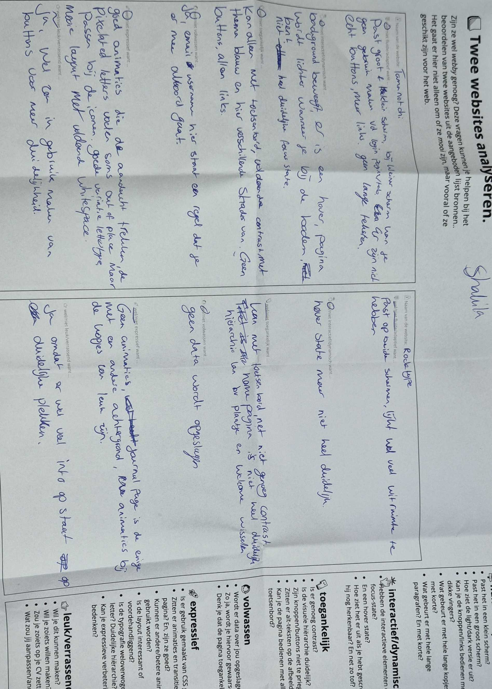

### 8 september huiswerk voor woensdag

Presentatie gemaakt zie folder 'oefeningen'

Deepdive Light N Dark gemaakt:
Opdracht 1:
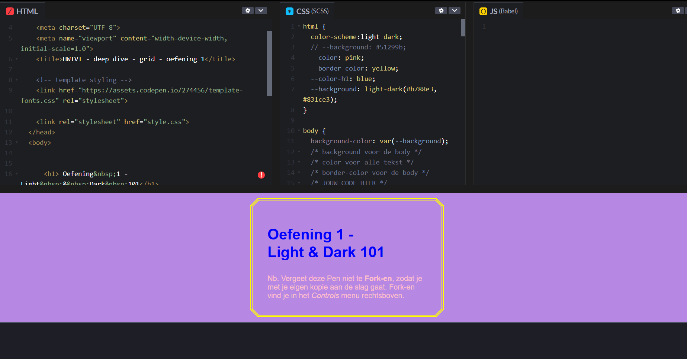
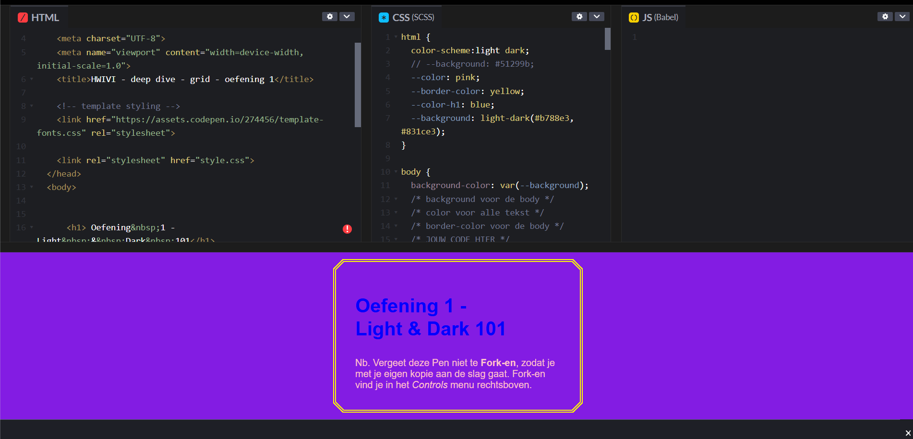

opdracht 2:

### 9 september online les

Wat is voor jou de essentie van wat je hebt gepresenteerd qua onderwerp en geschreven/beeldende content? ​
Dat het een breed onderwerp is met enorm veel details die je kan ontdekken.

Welke woorden uit de kwaliteitenlijst kunnen passen bij je onderwerp?​

Heeft 'de ander' een aanvulling op je onderwerp?​
Hij vond het een cool onderwerp

Wat is het karakter/ de uitstraling/ het gevoel dat bij het onderwerp past? (bijv. stoer, hip, vrolijk, dynamisch, eenvoudig, enz.)​
Dramatisch, oud en chic

Welke inspiratie kun je uit je 25 afbeeldingen halen. Stijl, een gevoel, vorm, enz.
Veel blauw, rood, wit en goud. Denk royaal met het gevoel dat je alles moet weten. Ik denk dan aan sterren en
weide ogen gevuld met nieuwsgierigheid.

Ik wil mijn Digital Garden laten gaan over Griekse mythologie.
en wil dat laten zien door foto's en tekst aan content te tonen.
Ik begin met een stukje eigen content over waarom ik Griekse mythologie leuk vind
Als het begin is gemaakt kan ik mijn Garden verder uitbreiden door in te gaan op specifieke goden/verhalen

Visual Research:

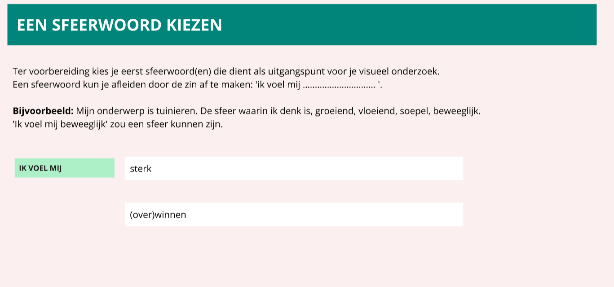
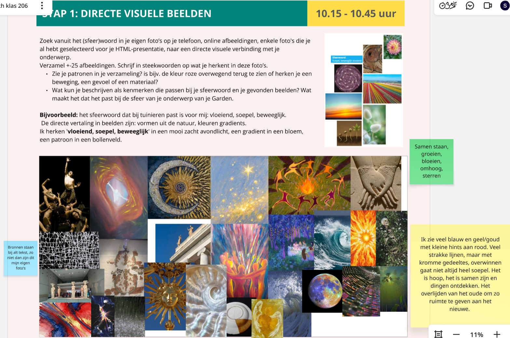
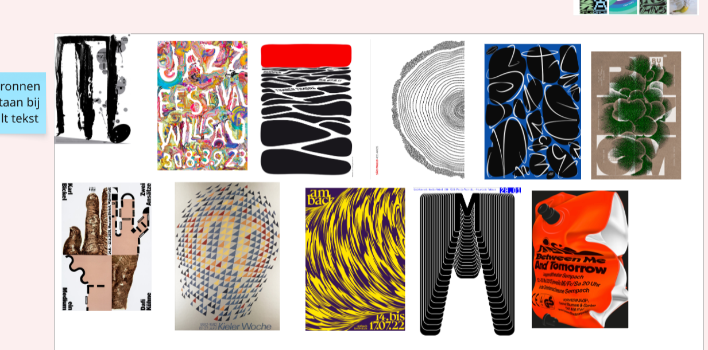
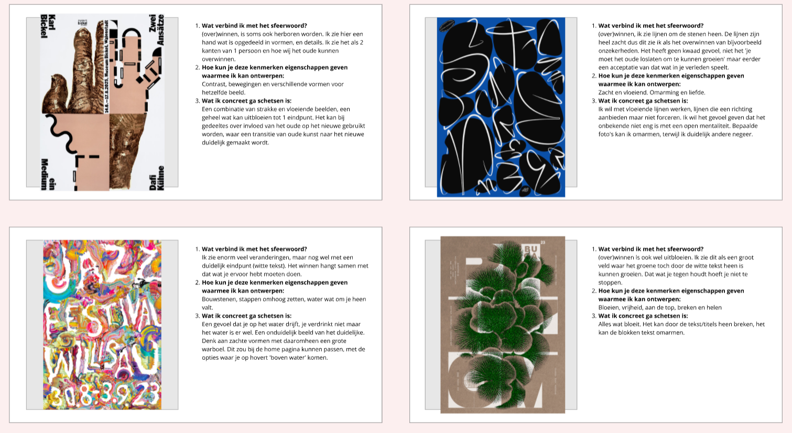
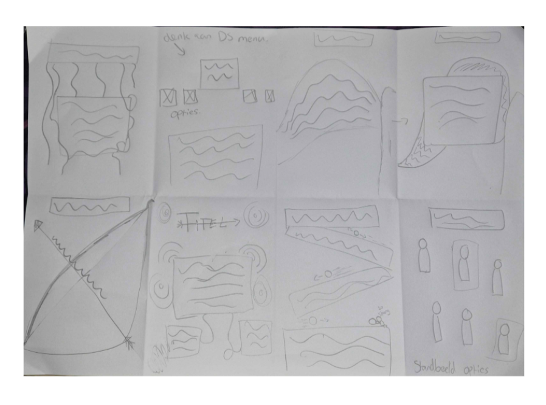
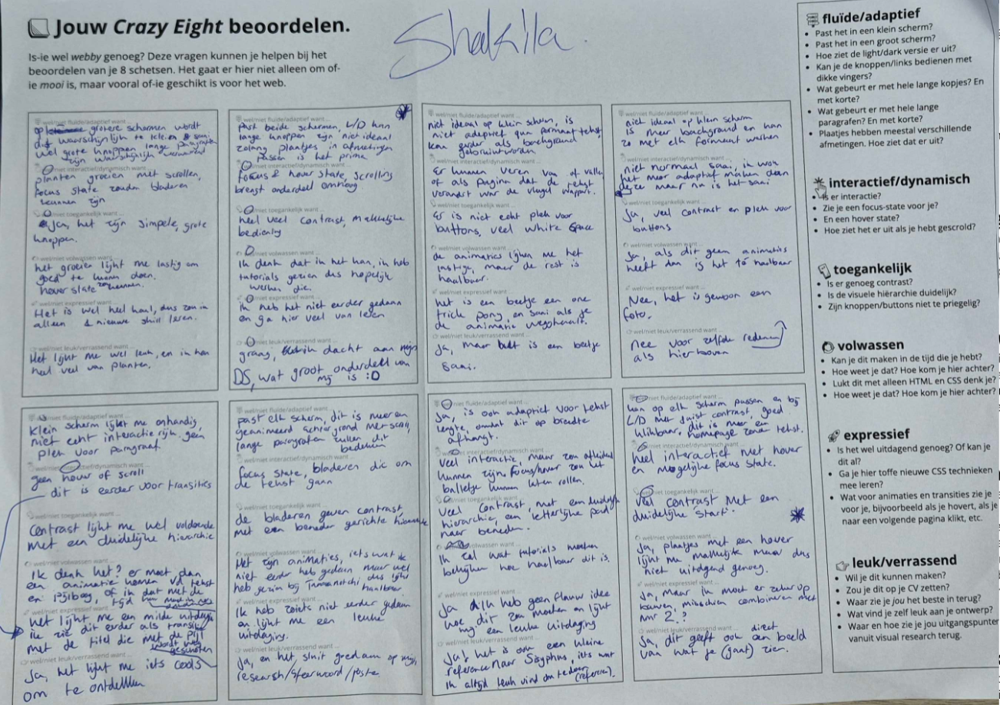

Checkout

-Leg uit waar het Visual Research in 3 stappen naartoe werkt

1. Visuele bronnen opzoeken a.d.v bv een sfeerwoord
2. Bekijk de kenmerken hiervan en hoe dit abstract vertaald kan worden (niet cliché denken)
3. Kijk naar dat wat je zoekt, wat verbindt het abstracte beeld met het sfeerwoord

-Vertel in 2 zinnen waar jouw Garden over gaat, en met welke content je dat gaat doen (beeld, tekst, sound, animatie enz).
Mijn DG gaat over Griekse mythologie, waar ik het zal hebben over mijn eigen interpretaties en conclusies. Dit wil ik doen a.d.v tekst, beeld en animaties.

-Vertel kort welk idee van de Crazy 8 je het liefst zou willen uitvoeren/ verder zou willen onderzoeken.
Ik zou graag idee 2 en 8 (gemarkeerd met een ster) willen samenvoegen en uitwerken. Dit lijkt mij een goede uitdaging om er van te leren, maar ook dat de 'wow' factor niet volledig op 1 grote animatie leunt.

### 10 sept Huiswerk

Schermen:

Deepdive:
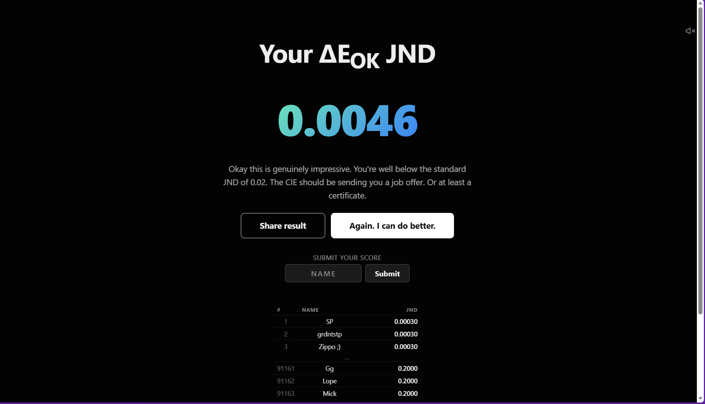
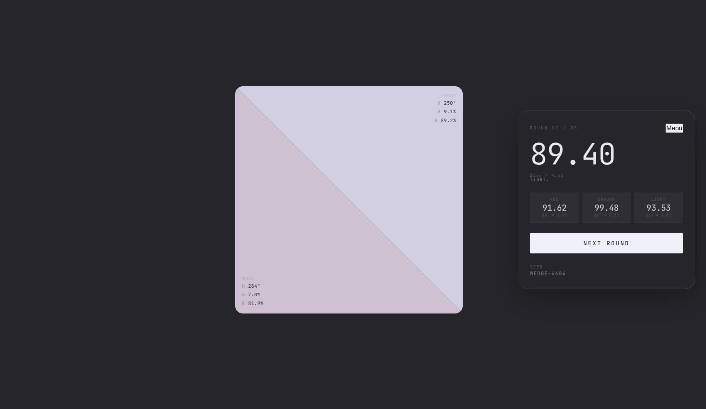
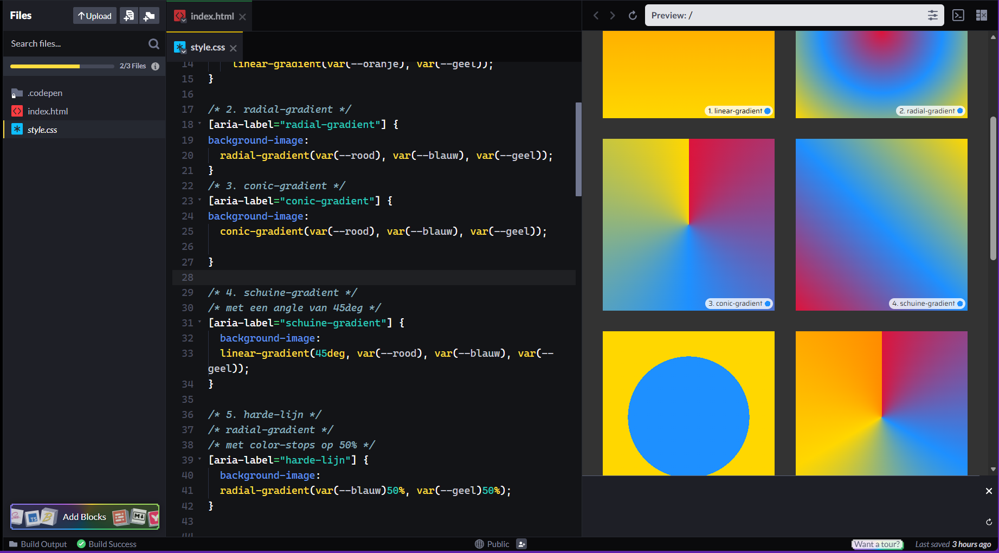
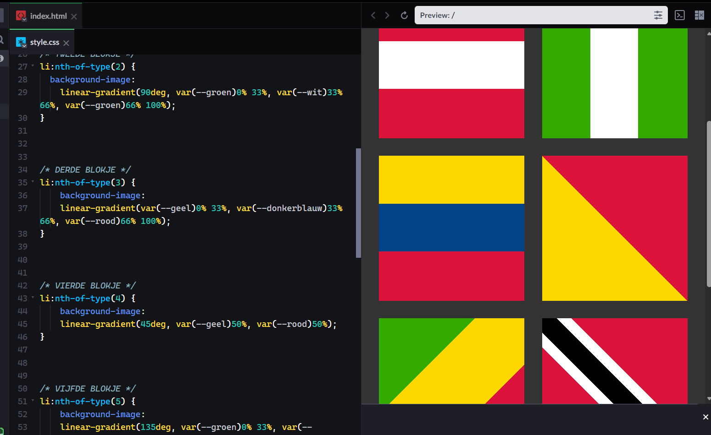

### 11 sept Feedback

Check-out:
Feedback, klépos met sisyphus no go zone -> het is 1 kleine animatie en verder vrij weinig
Idee met 'ds-menu' is heel leuk, meer persoonlijk en interessan/uitdagend om uit te werken.

Technische vragen;
Images met een carousel
Carousel functie(?) met een scrollbar
Overflow-x:scroll functie

Bronnen gekregen van Maarten te Poele: https://lab.chsmc.org/scroll-out-scaling & https://codepen.io/krijnhoetmer/pen/qBgGwLB

FDND: Scroll-snap carousel
Bronnen binnennin website vermeldenm, evt met links van foto’s en APA naar tekst

### 12 sept huiswerk

Artikellen en video's gelezen/bekeken.
Belangrijkste punten vanuit mijn notities;

We zitten in onze eigen echo chamber, waar onze info alleen van degene die we kiezen te horen krijgen. Je volgt extreem rechte accounts en zal alleen die bias horen. We zijn geïsoleerd van debatten, en kunnen geen scheiding meer maken tussen feit, mening en nep nieuws.

AI zit nu binnenin enorme bedrijven die weer in hun eigen echo chamber zitten en proberen slim te worden door alleen naar zichzelf te kijken.
De monopolies van deze bedrijven zijn erg slecht, het stopt innovatie en weerhoudt mensen van groeien, proeven en voelen.

### 14 sept

Feedback; Let erop dat dit goed klein en groter kan worden in de website, niet te veel letten op de CSS, focus voor nu op de HTML.
Bij de verschillende goden verschillende achtergronden bij het scrollen.

Bekijken van andere websites:
https://immersivebags.miumiu.com/en/
https://why.zero.university/
https://assets.awwwards.com/awards/external/2017/07/595badffaf6a2.mp4

Check-out

Leg uit wanneer een website 'lelijk' wordt en geef voorbeelden wat je kan doen om deze 'lelijke' onderdelen te fixen?
Afbeeldingen die te groot zijn, teksten die te lang zijn en wanneer der niet meegeschaald wordt. Dit kan je fixen door een max-width toe te voegen en evt padding.

Vertel welke volgende stap je neemt om je website responsive te maken.
Ik ga nu letten op de indeling van mijn pagina, en wil het maken dat wanneer de pagina vergroot wordt er meer kopjes bij komen afmaken.

Kun je het ontwerp en de bouw van je eigen Garden (zo uit je hoofd) onderbouwen in Webby vocabulair?
Het is toegangelijk met grote buttons die het gebruik makkelijker maken.
